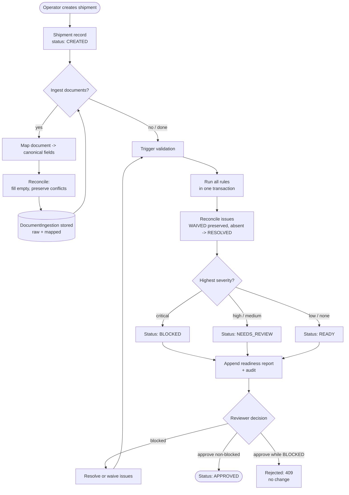

# Design — Compliance review process (BPMN-style flow)

The operational flow the system automates, from shipment creation to approval.
Rendered as a Mermaid flowchart (a lightweight stand-in for BPMN).

## Notes

- Every transition that changes state appends an **AuditLog** entry
  (`SHIPMENT_CREATED`, `DOCUMENT_INGESTED`, `FIELD_UPDATED`, `VALIDATION_RUN`,
  `STATUS_CHANGED`, `REPORT_GENERATED`, `SHIPMENT_APPROVED`).
- Validation is a single atomic recompute (ADR-0002); re-running it after a fix
  loops back through the same path.
- Approval is guarded by the readiness model (ADR-0003): a BLOCKED shipment
  cannot advance.
