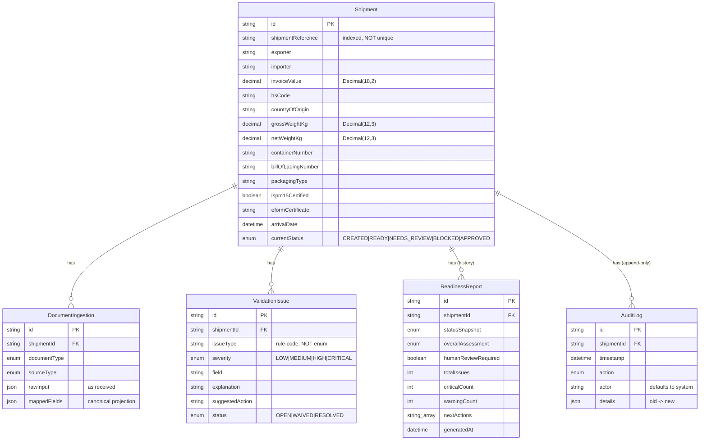

# Design — Entity map

The persistence model (Postgres via Prisma). `Shipment` is the canonical record;
every other entity hangs off it and cascades on delete.

## Indexing notes

Postgres does not auto-index foreign keys, so read paths are indexed explicitly:
`ValidationIssue(shipmentId, status)` and `(shipmentId, issueType, field)` (the
reconcile key), `ReadinessReport(shipmentId, generatedAt)`,
`AuditLog(shipmentId, timestamp)`, `DocumentIngestion(shipmentId)`, and
`Shipment(shipmentReference)` (not unique — duplicates must persist so the
duplicate-reference rule can flag them).
